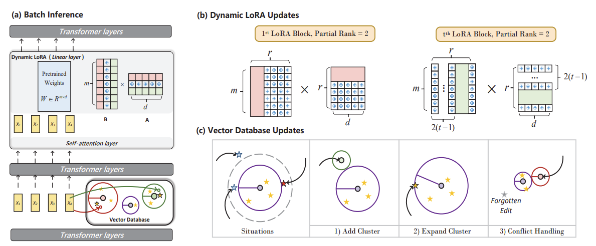
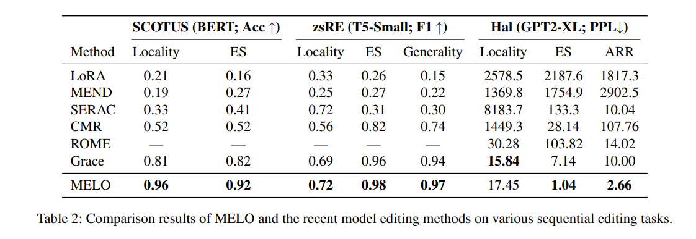

<!-- omit in toc -->
# MELO: Model Editing with Dynamic LoRA
This repo contains the source code of our proposed MELO, a plug-in model editing method, which routes models' behavoir by dynamically indexing LoRA blocks according to a inner vector databse. Seamlessly integrated in [PEFT](https://github.com/huggingface/peft), MELO supports multiple LLMs such as BERT, T5 and GPT. 

<!-- omit in toc -->
## Updates
- **2023/7/16:** Experiments with multiple LLMs on different editing tasks. :art:
- **2023/6/24:** Inner vector databse that builds accurate editing scope. :confetti_ball:	
- **2023/6/08:** Support dynamic LoRA block Loding. :star:

<!-- omit in toc -->
## Table of Contents
- [Introduction](#introduction)
- [Experiments](#experiments)
- [Prepare Environments](#prepare-environments)
- [Prepare Datasets](#prepare-datasets)
- [Quick Start](#quick-start)
- [Acknowledgments](#Acknowledgments)
## Introduction
Due to the limitation of catastrophic forgetting and the lack of locality, few studies explore recent advanced Low-rank Adapter (LoRA) techniques for continual model editing. To overcome these limitations and take advantage of LoRA's resource efficiency, we propose MELO, a plug-in model editing method implemented with dynamic LoRA, which routes the behavior of language models by dynamically indexing LoRA blocks according to an inner vector database. MELO considers all editing properties and can be easily integrated into multiple LLMs such as BERT, T5 and GPT. Experimental results show that our proposed MELO achieves state-of-the-art editing performance on three sequential editing tasks (document classification, question answering and hallucination correction), while requires the least trainable parameters and computational cost.


## Experiments
Comparison of MELO to prior editing methods on sequential editing tasks. Note that MELO edits all language models with a single RTX 3090 GPU.


## Prepare Environments
Required CUDA environment and library dependencies are listed in: 
```
requirements.txt
```
Then you should install our modified PEFT:
<h1 align="center"> <p>🤗 PEFT-MELO</p></h1>

```
cd peft_egg
pip install -e .
```
Detailed implementation of MELO is in `./peft_egg/src/tuners/melo.py`
## Prepare Datasets
The zsRE experiments use data linked by the [MEND](https://github.com/eric-mitchell/mend) repository. Download the data for NQ and zsRE from their Google Drive link and unzip each sub-directory into ./melo/data. SCOTUS and Hallucination data are loaded through huggingface.

## Quick Start
The location of inner vector database and dynamic LoRA target modules can be modified in `./melo/model/config`

### Editing GPT2-XL on Hallucination with MELO
```
cd melo
python run.py +alg=lora +experiment=hallucination +model=gpt2xl
```

### Editing BERT on SCOTUS with MELO
```
cd melo
python run.py +alg=lora +experiment=scotus +model=scotus-bert
```

### Editing T5 on zsRE with MELO
```
cd melo
python run.py +alg=lora +experiment=qa +model=t5small
```


## Acknowledgments
We would like to thank the following individuals and organizations for their contributions to this project:
```
Huggingface: for their support of the PEFT community and their development of the PEFT framework (https://github.com/huggingface/peft)

GRACE: for the development of the open-source library GRACE which inspired our work (https://github.com/Thartvigsen/GRACE)
```
